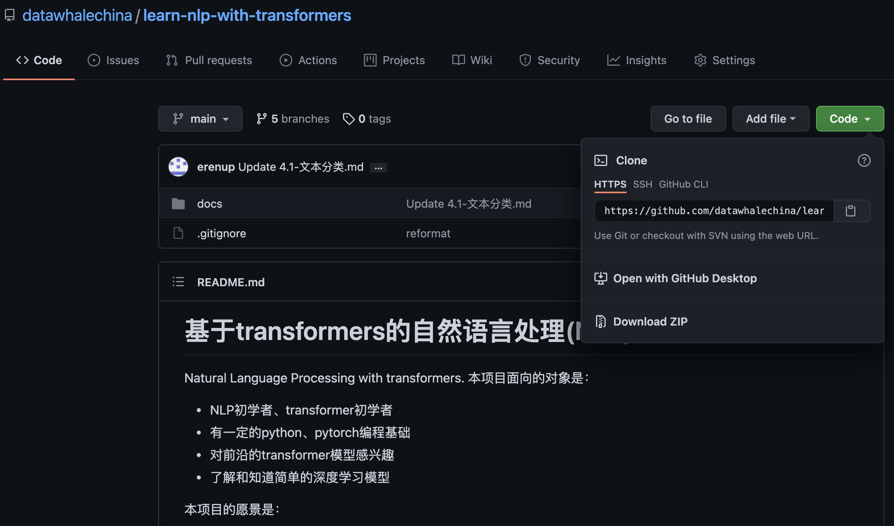

# 环境配置
## 下载本项目所有文件
点击本网页右上角的Github标识，进入github页面，找到下载/clone链接：

- 选项1: 直接点击`Download ZIP`即可下载全部内容
- 选项2: 以Mac电脑为例，在Terminal中clone代码库
```
git clone https://github.com/datawhalechina/learn-nlp-with-transformers.git
```
## 配置本项目本地运行环境
### 本地vscode打开项目文件夹
建议通过vscode软件打开本项目文件夹，vscode可以直接预览Markdown格式的文档，入下图最右边所示：

### 本地环境配置（以Mac为例）
1. 在vscode中新建一个Terminal，用于安装一个新的python环境和相应的python依赖包：

2. 在Terminal中通过`virtualenv`软件安装python环境到`venv`文件夹下：
```
virtualenv -p python3 venv
```
3. 激活python环境：
```
source activate venv/bin/activate
```
> 创建环境也可以通过anaconda，conda create -n nlp python=python3

4. 激活python环境后的Terminal最左边会显示`(venv)`，可以使用`which python`命令来查看当前Terminal窗口中所使用的python软件所在的位置，确保python处于`your_path/learn-nlp-with-transformers/venv/bin/python`位置。最后，安装依赖包：

```
pip install -r requirements.txt
```
5. 项目中的以`.md`结尾的文件都是Markdown格式，可以直接vscode阅读，编程环节涉及的`.ipynb`文件为jupyter notebook格式，vscode可以直接打开和运行这些文件，使用jupyter notebook打开这些文件：

6. 鼠标放置在代码框上，左边会有一个▶️符号，点击即可运行，运行时会提示选择运行使用的python，请选择步骤4`which python`所指向的python路径。

7. 如果提示部分python包不存在（比如transformers），在Terminal终端通过`pip install transformers`即可。

## 上传到google colab打开
本教程也可以在google colab打开，可以使用其免费的cpu和gpu资源，自己直接将代码库中ipynb结尾的文件上传到google drive中，然后双击打开即可。如果需要下载大文件，可以挂载google drive，免费15G，更大的文件得自己升级了。

